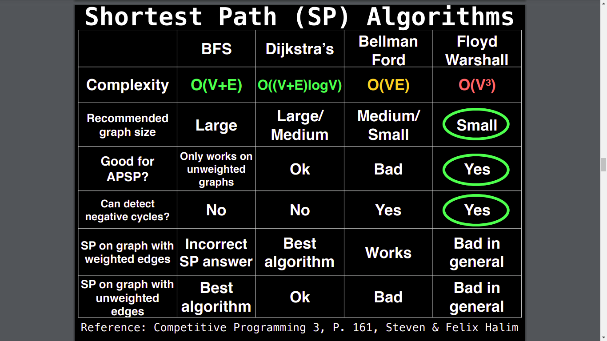

## topological sort
  - [Topological sort (301)](topological_sort.md)

## Short test 
  - [Shortest and longest paths on DAGs (406)](shortest_and_longest_paths_on_DAGs.md)
  - [Dijkstra's algorithm (page 430)](dijkstra's_algorithm.md)
  - [Floyd-Warshall Algorithm (page 606)](floyd-warshall_algorithm.md)

## Algorithm to Find Bridges and Articulation Points ([660  748]())
  - [bridges_and_articulation_points](bridges_and_articulation_points.md)
## Finding Strongly Connected Components
  - [Tarjan’s Algorithm for Finding Strongly Connected Components (page 771)](tarjan’s_algorithm_for_finding_strongly_connected_components.md)

## Prim’s Minimum Spanning Tree Algorithm (1071)