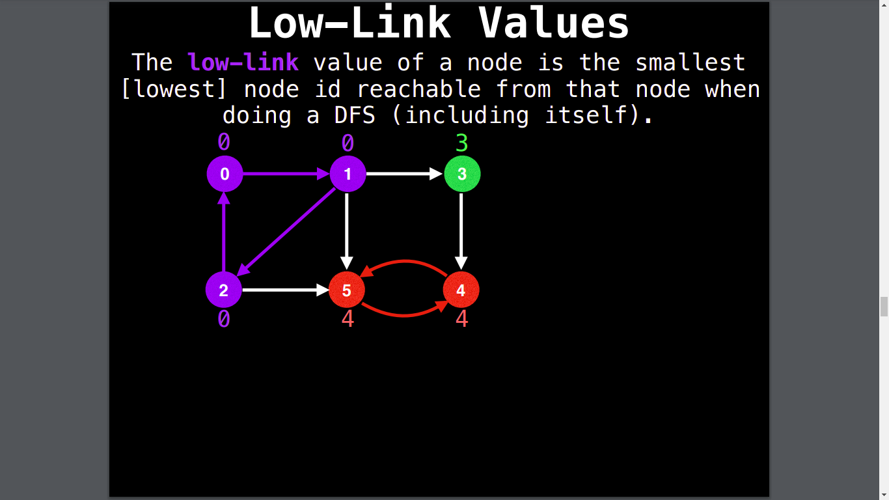
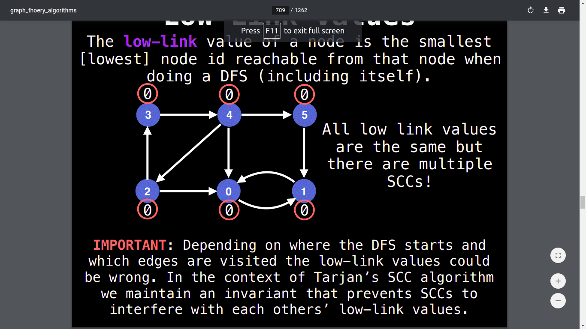

# Tarjan’s Algorithm for Finding Strongly Connected Components
>## What are SCCs?
>Strongly Connected Components (SCCs) can be thought of as **self-contained cycles** within a **directed graph** where every vertex in a given cycle can reach every other vertex in the same cycle.

    The low-link value of a node is the smallest [lowest] node id reachable from that node when doing a DFS (including itself).

    IMPORTANT: Depending on where the DFS starts and which edges are visited the low-link values could be wrong. In the context of Tarjan’s SCC algorithm we maintain an invariant that prevents SCCs to interfere with each others’ low-link values. 
